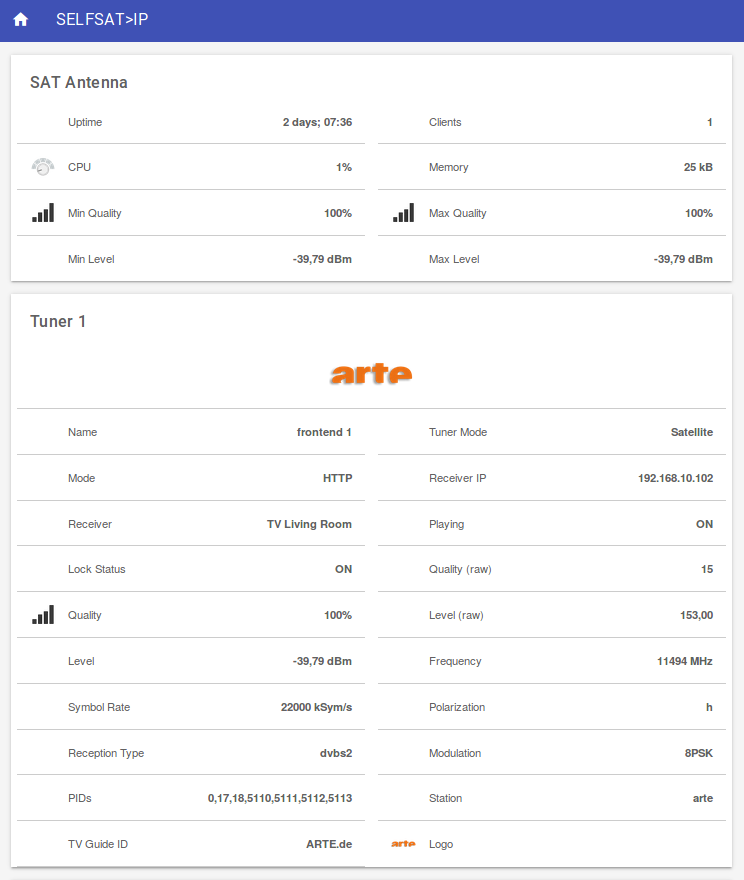

# <bindingName> Binding

This binding provides access to _SELFSAT>IP_ ([selfsat.com](http://www.selfsat.com/)) antenna devices. 

General information about the antenna, 
as well as detailed information about the built-in _SAT>IP_ server can be retrieved from the device using this binding. 
For each of the 8 SAT>IP tuners, this binding provides detailed information like signal quality, tuned TV station and the streaming client (e.g. the TV that is actually receiving the stream).

The following sample Dashboard displays information about the antenna device in general, and the first SAT>IP tuner:

<a href="doc/selfsatip-dashboard.png"></a>

## Supported Things

This binding was developed and tested using a SELFSAT>IP 21 with firmware `3.1.18`.

It's not guaranteed by the developer of this binding that other SELFSAT>IP models are compatible with this binding. 
However, since all SELFSAT>IP antennas seem to share the same firmware, it's expected that other models are also 
accessible through this binding. Feedback on compatibility with other models than SELFSAT>IP 21 is highly appreciated.

Beside providing status information about the antenna device, a SELFSAT>IP Thing can optionally translate SAT>IP tuner 
information, that are retrieved from the antenna, into user friendly TV station names and logos/images.
For that purpose a EXTM3U formatted playlist is required by the Thing. Often, such a playlist is used anyway to watch the SAT>IP streams, 
e.g. when using Kodi ([kodi.tv](https://kodi.tv/)), so that this can be reused.

## Discovery

No auto discovery available yet.

## Thing Configuration

The Thing configuration includes a mandatory part and a optional part. Configuration is possible via PaperUI or a `.things` file.

**Mandatory Thing Configuration**

The mandatory part configures access to the SELFSAT>IP device using the following Thing properties:
    
* `host` : antenna host address (name or IP)
* `user` : the admin user name
* `password` : the user password
* `refresh` : refresh interval in seconds

**Optional Thing Configuration**

Setting up the TV station translation is optional and contains the following Thing properties:

* `playlistAddress` : URL to the TV station playlist (e.g. same address as used in Kodi)
* `playlistRefresh` : interval to check the above playlist URL for updates (in hours)

## Channels

**Device specific channels**

Channel Group: generalInfo 

| Channel Type ID   | Item Type | Description                                           |
|-------------------|-----------|-------------------------------------------------------|
| status            | String    | Antenna Status |
| uptime            | String    | Uptime of the antenna |
| cpuLoad           | Number    | Current CPU utilization of the antennas SAT>IP server |
| memoryUtilization | Number    | Current memory consumption of the antennas SAT>IP server |
| noOfClients       | Number    | Number of currently connected clients |
| minSignalQuality  | Number    | Minimum signal quality of all active tuners |
| maxSignalQuality  | Number    | Maximum signal quality of all active tuners |
| minSignalLevel    | Number    | Minimum signal level of all active tuners |
| maxSignalLevel    | Number    | Maximum signal level of all active tuners |

**Tuner specific channels**

For each of the 8 tuners the same set of channels is available as listed below. 

Channel Group: tunerX (where 'X' is a number representing the tuner, 1-8) 

| Channel Type ID   | Item Type | Description                                           |
|-------------------|-----------|-------------------------------------------------------|
| name              | String    | Name/Number of the tuner |
| tunerType         | String    | Type of the tuner |
| mode              | String    | Mode of the tuner |
| ipAddress         | String    | IP address of the streaming client device |
| ipAddressResolved | String    | Resolved domain name of the streaming client device |
| playing           | Switch    | Currently playing flag |
| lock              | Switch    | Currently locked flag |
| signalQuality     | Number    | Signal quality (raw value) |
| signalQualityNorm | Number    | Signal quality in percent |
| signalLevel       | Number    | Signal leveln(raw value) |
| signalLevelNorm   | Number    | Signal level in dBm |
| frequency         | Number    | Frequency of the tuned TV station |
| symbolRate        | Number    | Symbol rate of the tuned TV station |
| polarisation      | String    | Polarization of the tuned TV station |
| receptionType     | String    | Reception type of the tuned TV station |
| modulation        | String    | Modulation of the tuned TV station |
| pids              | String    | List of PIDs of the tuned TV station |
| station           | String    | TV Station name (title from the playlist)<br>_Note: only available if the TV station translation is configured for the antenna Thing_ |
| tvgId             | String    | TV Guide ID (`tvg-id`)<br>_Note: only available if the TV station translation is configured for the antenna Thing._ |
| logo              | String    | TV Station logo image (`tvg-logo`)<br>_Note: only available if the TV station translation is configured for the antenna Thing._ |
| logoUrl           | String    | TV Station logo image URL (`EXTALBUMARTURL`)<br>_Note: only available if the TV station translation is configured for the antenna Thing._ |

## Full Example

SELFSAT>IP Thing configuration file:
```xtend
selfsatip:antenna:antenna  "SELFSAT>IP Antenna"  [ \\
                                                   host="192.168.1.2", \\
                                                   user="user", \\
                                                   password="password", \\
                                                   refresh=60, \\
                                                   playlistAddress="http://192.168.1.3/playlist.m3u", \\
                                                   playlistRefresh=24 \\
                                                 ]
```

Example of items and their linked channels respectively:

```xtend
// General Antenna Information
String SelfsatIpStatus                  "[%s]"                 { channel="selfsatip:antenna:antenna:generalInfo#status" }
String SelfsatIpUptime                  "[%s]"                 { channel="selfsatip:antenna:antenna:generalInfo#uptime" }
Number SelfsatIpCpuLoad                 "[%d%%]"               { channel="selfsatip:antenna:antenna:generalInfo#cpuLoad" }
Number SelfsatIpMemoryUtilization       "[%d kB]"              { channel="selfsatip:antenna:antenna:generalInfo#memoryUtilization" }
Number SelfsatIpNoOfClients             "[%d]"                 { channel="selfsatip:antenna:antenna:generalInfo#noOfClients" }
Number SelfsatIpMinSignalQuality        "[%.0f%%]"             { channel="selfsatip:antenna:antenna:generalInfo#minSignalQuality" }
Number SelfsatIpMaxSignalQuality        "[%.0f%%]"             { channel="selfsatip:antenna:antenna:generalInfo#maxSignalQuality" }
Number SelfsatIpMinSignalLevel          "[%.2f dBm]"           { channel="selfsatip:antenna:antenna:generalInfo#minSignalLevel" }
Number SelfsatIpMaxSignalLevel          "[%.2f dBm]"           { channel="selfsatip:antenna:antenna:generalInfo#maxSignalLevel" }
 
// Tuner 1
String SelfsatIpTuner1Name              "[%s]"                 { channel="selfsatip:antenna:antenna:tuner1#name" }
String SelfsatIpTuner1TunerType         "[%s]"                 { channel="selfsatip:antenna:antenna:tuner1#tunerType" }
String SelfsatIpTuner1Mode              "[%s]"                 { channel="selfsatip:antenna:antenna:tuner1#mode" }
String SelfsatIpTuner1IpAddress         "[%s]"                 { channel="selfsatip:antenna:antenna:tuner1#ipAddress" }
String SelfsatIpTuner1IpAddressRes      "[%s]"                 { channel="selfsatip:antenna:antenna:tuner1#ipAddressResolved" }
Switch SelfsatIpTuner1Playing           "[%s]"                 { channel="selfsatip:antenna:antenna:tuner1#playing" }
Switch SelfsatIpTuner1Lock              "[%s]"                 { channel="selfsatip:antenna:antenna:tuner1#lock" }
Number SelfsatIpTuner1SignalQuality     "[%d]"                 { channel="selfsatip:antenna:antenna:tuner1#signalQuality" }
Number SelfsatIpTuner1SignalQualityNorm "[%.0f%%]"             { channel="selfsatip:antenna:antenna:tuner1#signalQualityNorm" }
Number SelfsatIpTuner1SignalLevel       "[%.2f]"               { channel="selfsatip:antenna:antenna:tuner1#signalLevel" }
Number SelfsatIpTuner1SignalLevelNorm   "[%.2f dBm]"           { channel="selfsatip:antenna:antenna:tuner1#signalLevelNorm" }
Number SelfsatIpTuner1Frequency         "[%s MHz]"             { channel="selfsatip:antenna:antenna:tuner1#frequency" }
Number SelfsatIpTuner1SymbolRate        "[%s kSym/s]"          { channel="selfsatip:antenna:antenna:tuner1#symbolRate" }
String SelfsatIpTuner1Polarization      "[%s]"                 { channel="selfsatip:antenna:antenna:tuner1#polarisation" }
String SelfsatIpTuner1ReceptionType     "[%s]"                 { channel="selfsatip:antenna:antenna:tuner1#receptionType" }
String SelfsatIpTuner1Modulation        "[%s]"                 { channel="selfsatip:antenna:antenna:tuner1#modulation" }
String SelfsatIpTuner1Pids              "[%s]"                 { channel="selfsatip:antenna:antenna:tuner1#pids" }
 
// Tuner 2
String SelfsatIpTuner2Name              "[%s]"                 { channel="selfsatip:antenna:antenna:tuner2#name" }
...
 
// Tuner 3
...
```

The tuner specific section needs to be repeated for each of the 8 tuners.

In a Sitemap, the items can be used as shown in this example:

```xtend
Frame label="TV" visibility=[SelfsatIpTuner1Playing==ON]
{
    Text item=SelfsatIpTuner1Station            label="Station" 
    Text item=SelfsatIpTuner1IpAddressRes       label="Player"  icon="receiver"
    Text item=SelfsatIpTuner1SignalQualityNorm  label="Signal"  icon="qualityofservice"
    Text item=SelfsatIpTuner1SignalLevelNorm    label="Level"        			
}
```

The text item `SelfsatIpTuner1Station` in the example above contains a user friendly TV station name (see _TV Station Translation_ section in this document for more information about that).


## TV Station Translation

Optionally, the tuner information provided by the SELFSAT>IP device can be translated to user friendly TV station names and respective logo images.

For that purpose, the Thing configuration expects a link to a EXTM3U formatted playlist that follows the same rules as required by the 
Kodi IPTV Simple Client ([kodi.wiki/view/Add-on:IPTV_Simple_Client](https://kodi.wiki/view/Add-on:IPTV_Simple_Client)).

Example of an EXTM3U playlist file for one TV station with name, logo and stream URL:

```INI
#EXTM3U
#EXTINF:0 tvg-id="ARTE.de" tvg-logo="arte.png",arte
#EXTALBUMARTURL:http://192.168.1.3/logos/arte.png
http://192.168.1.2/?src=1&freq=11494&pol=h&ro=0.35&msys=dvbs2&mtype=8psk&plts=on&sr=22000&fec=23&pids=0,17,18,5110,5111,5112,5113
```

Once the station gets streamed by one of the antennas SAT>IP tuners, the translated TV station name and logo are available via the following channels:

```xtend
String SelfsatIpTuner1Station           "[%s]"                 { channel="selfsatip:antenna:antenna:tuner1#station" }
String SelfsatIpTuner1TVGId             "[%s]"                 { channel="selfsatip:antenna:antenna:tuner1#tvgId" }
String SelfsatIpTuner1Logo              "[%s]"                 { channel="selfsatip:antenna:antenna:tuner1#logo" }
String SelfsatIpTuner1LogoUrl           "[%s]"                 { channel="selfsatip:antenna:antenna:tuner1#logoUrl" }
```
